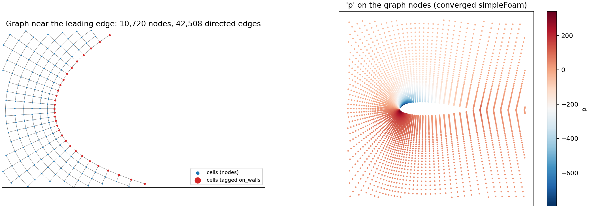

# foam2ml

**Turn OpenFOAM cases into machine-learning-ready data** — graphs for GNNs, regular grids for neural operators.

Every ML-for-CFD project ends up writing its own throwaway OpenFOAM reader. foam2ml is meant to be the one you
install instead: read a case directory directly (no `foamToVTK` step), get mesh geometry that agrees with
OpenFOAM's own to rounding error, and export it in the shape your model expects.



*OpenFOAM's airFoil2D tutorial through `to_graph()`: every cell is a node, every internal face an edge, and cells
touching the wall are tagged. Right: the converged pressure field on the nodes. Made with
[`examples/plot_graph.py`](examples/plot_graph.py).*

> **Status: early development (0.1.0.dev0).** Reading, mesh geometry and graph export work and are tested
> against OpenFOAM. Grid export for neural operators is next — see the roadmap.

## Quickstart: a case to a PyTorch Geometric graph

```python
from foam2ml import to_graph

g = to_graph("airFoil2D", fields=["U", "p"], params={"aoa": 4.0})
g            # Graph(nodes=10720, edges=42508, x=['pos_x', 'pos_y', 'area', 'on_inlet', 'on_outlet', 'on_walls'],
             #       y=['U_x', 'U_y', 'p'], edge_attr=['dx', 'dy', 'dist', 'length', 'n_x', 'n_y'], params={'aoa': 4.0})

data = g.to_pyg()                 # torch_geometric.data.Data — ready for any PyG model
g.save("case_000.npz")            # or keep it framework-free: plain NumPy arrays plus column names
```

- **Nodes** are cells. `x` holds the model's inputs — position, cell area/volume, and a 0/1 tag per boundary
  patch — and `y` holds the fields you want to predict. Every column is named (`x_names`, `y_names`).
- **Edges** are internal faces, both directions by default, with features `[d, distance, face length/area, unit normal]`.
  Normals always point from source to target cell.
- **2D meshes are handled properly.** OpenFOAM's 2D cases are one cell thick with an arbitrary depth; foam2ml
  drops the out-of-plane axis and divides by the depth, so areas and face lengths don't depend on a meaningless number.
- PyTorch is optional: `pip install "foam2ml[pyg]"` only if you want `to_pyg()`.

## What works today

```python
from foam2ml import Case

case = Case("cavity")
case.mesh                 # Mesh(2D (normal axis z): 400 cells, 1640 faces (760 internal), 882 points, ...)
case.times()              # ['0', '0.1', ..., '0.5']

U = case.field("U")       # (400, 3) cell values at the latest time
p = case.field("p", "0.1")

mesh = case.mesh
mesh.cell_centres         # (400, 3) — identical to OpenFOAM's writeCellCentres
mesh.cell_volumes         # (400,)
mesh.face_areas           # (1640, 3) area vectors, pointing out of the owner cell
mesh.cell_adjacency()     # (2, 760) cell pairs joined by internal faces — the graph's edges
mesh.patch_cells("movingWall")
```

- Reads `points`, `faces` (classic and compact formats), `owner`, `neighbour`, `boundary`
- Reads volume fields: uniform or non-uniform `internalField`, and per-patch boundary types and values
- Computes face centres and area vectors, and cell centres and volumes, with OpenFOAM's own algorithms
- Detects OpenFOAM's one-cell-thick 2D meshes (`empty` patches) and their normal axis
- Pure Python + NumPy, no OpenFOAM installation needed to read cases

## How it's validated

The test suite compares against **OpenFOAM's own output**, not against itself:

- Cell centres and volumes match OpenFOAM's `writeCellCentres` / `writeCellVolumes` (written at 17 digits)
  on the lid-driven cavity, which ships with the tests
- The same comparison runs live on the graded **pitzDaily** mesh and the curved, stretched **airFoil2D** mesh
  when OpenFOAM is installed — meshes where a naive vertex-average centre would be visibly wrong
- Graph edges are checked for consistency: displacements match node positions, normals are unit length and
  point across every face, including on airFoil2D's curved, stretched cells, and a GNN forward pass runs on the output
- Every cell's outward face-area vectors sum to zero (the divergence theorem), confirming closed, consistently
  oriented cells

```bash
pip install -e ".[dev]"
pytest                    # live OpenFOAM comparisons run automatically if OpenFOAM is on your PATH
```

## Roadmap

- [x] Native ASCII reader for polyMesh and volume fields
- [x] Mesh geometry matching OpenFOAM
- [x] **Graph export** — cells as nodes, internal faces as edges, boundary patches tagged; NumPy `.npz` or PyG `Data`
- [ ] Boundary-face nodes carrying boundary-condition values (inlet velocity, wall), for models that need them
- [ ] **Grid export for neural operators** — resample onto a regular grid with a geometry mask channel,
      so an FNO can tell solid from fluid
- [ ] **Datasets** — a folder of cases (parameter sweeps) into one dataset, case parameters attached,
      dataset-level normalisation statistics saved
- [ ] CLI: `foam2ml convert ./cases --to pyg | grid`
- [ ] Binary-format files, decomposed (parallel) cases, polyhedral meshes from snappyHexMesh

## License

Apache-2.0. Not approved or endorsed by OpenCFD Ltd, producer and distributor of the OpenFOAM software via
www.openfoam.com, and owner of the OPENFOAM® and OpenCFD® trade marks.
