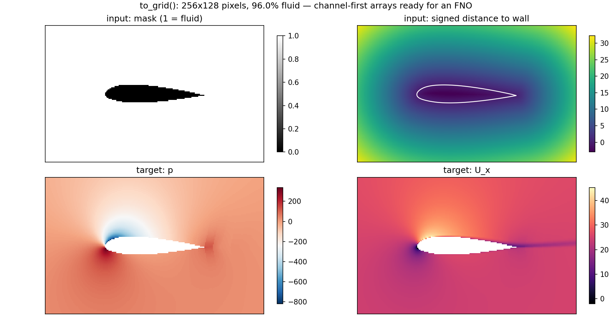

# foam2ml

Turn OpenFOAM cases into machine-learning-ready data: graphs for graph neural networks, and regular grids for
neural operators such as FNOs.


## Install

```bash
pip install git+https://github.com/meshram1/foam2ml
pip install "foam2ml[pyg] @ git+https://github.com/meshram1/foam2ml"   # with PyTorch Geometric export
```

Requires Python 3.9+ and NumPy. OpenFOAM does not need to be installed to read cases.

## Read a case

```python
from foam2ml import Case

case = Case("cavity")              # path to an OpenFOAM case directory
case.times()                       # ['0', '0.1', ..., '0.5']
case.field_names()                 # ['U', 'p', ...] at the latest time

U = case.field("U")                # (n_cells, 3) at the latest time
p = case.field("p", "0.1")         # (n_cells,) at time 0.1
case.read("U").boundary            # per-patch boundary types and values

mesh = case.mesh
mesh.cell_centres                  # (n_cells, 3)
mesh.cell_volumes                  # (n_cells,)
mesh.face_centres, mesh.face_areas # (n_faces, 3); area vectors point out of the owner cell
mesh.cell_adjacency()              # (2, n_internal_faces) pairs of cells sharing a face
mesh.patch_cells("movingWall")     # cells next to a boundary patch
mesh.is_2d, mesh.normal_axis       # one-cell-thick 2D meshes are detected automatically
```

Reads `constant/polyMesh` (classic and compact face formats) and volume fields (uniform or non-uniform, with
boundary values) straight from the case directory. Mesh geometry is computed with OpenFOAM's own algorithms and
matches its output to rounding error.

## Export a graph

```python
from foam2ml import Graph, to_graph

g = to_graph("airFoil2D", fields=["U", "p"], params={"aoa": 4.0})
# Graph(nodes=10720, edges=42508,
#       x=['pos_x', 'pos_y', 'area', 'on_inlet', 'on_outlet', 'on_walls'],
#       y=['U_x', 'U_y', 'p'],
#       edge_attr=['dx', 'dy', 'dist', 'length', 'n_x', 'n_y'], params={'aoa': 4.0})

data = g.to_pyg()                  # torch_geometric.data.Data
g.save("case_000.npz")             # plain NumPy arrays plus column names
g = Graph.load("case_000.npz")
g.column("p")                      # any column by name
```

- **Nodes** are cells. `x` holds inputs (position, cell area or volume, a 0/1 tag for each boundary patch) and `y`
  holds the requested fields.
- **Edges** are internal faces, in both directions, with displacement, distance, face length (2D) or area (3D),
  and the unit face normal pointing from source to target.
- **2D meshes** drop the out-of-plane axis, and areas and lengths are divided by the mesh depth.

| Option | Default | Effect |
|---|---|---|
| `fields` | `()` | fields to put in `y` |
| `time` | latest | time directory to read |
| `params` | `{}` | case-level values stored on the graph, e.g. angle of attack |
| `patch_tags` | `"name"` | one tag column per patch name, `"type"` per patch type, or `"none"` |
| `include_volume` | `True` | add cell area/volume to `x` |
| `bidirectional` | `True` | include both directions of each face |

## Export an FNO grid

```python
from foam2ml import Case, patch_bounds, to_grid

case = Case("airFoil2D")
gs = to_grid(case, fields=["U", "p"], shape=(256, 128),
             bounds=patch_bounds(case.mesh, "walls", pad=0.6))
# GridSample(shape=(256, 128), fluid=96.0%, x=['mask', 'sdf', 'pos_x', 'pos_y'], y=['U_x', 'U_y', 'p'])

x, y = gs.to_torch()               # (4, 256, 128) inputs, (3, 256, 128) targets
gs.channel("p")                    # any channel by name, shape (256, 128)
on_mesh = gs.sample(prediction, case.mesh.cell_centres[:, :2])   # grid prediction back to cell centres
gs.save("case_000.npz")
```



- Each pixel takes its value from the mesh cell that contains it, so values never cross a solid body.
  Pixels outside every cell have `mask = 0` and zero targets.
- Inputs: `mask` (1 = fluid), `sdf` (signed distance to the walls: positive in fluid, negative in solid) and the
  pixel coordinates.
- Arrays are channel-first with `[channel, i, j]` indexing, `i` along x and `j` along y. To plot with matplotlib,
  use `imshow(gs.channel("p").T, origin="lower")`.
- `locate_points(mesh, points)` returns the cell containing any set of points, or -1.

| Option | Default | Effect |
|---|---|---|
| `fields` | `()` | field names, or a dict `{name: cell array}` of your own data |
| `shape` | `(128, 128)` | pixels along the two in-plane axes |
| `bounds` | whole mesh | `((xmin, xmax), (ymin, ymax))`; `patch_bounds(mesh, patch, pad)` crops around a body |
| `method` | `"linear"` | `"linear"` (cell value plus least-squares gradient) or `"cell"` (piecewise constant) |
| `walls` | all `wall` patches | patches the `sdf` channel measures to; `[]` removes it |
| `params` | `{}` | case-level values stored on the sample |

Grid export supports 2D (one-cell-thick) meshes.

## Examples

- [`examples/plot_graph.py`](examples/plot_graph.py) — draws a case's graph and a field on its nodes
- [`examples/plot_grid.py`](examples/plot_grid.py) — draws a case's grid channels

Both need matplotlib.

```bash
python examples/plot_grid.py path/to/case --wall walls --out grid.png
```

## License

Apache-2.0. Not approved or endorsed by OpenCFD Ltd, producer and distributor of the OpenFOAM software via
www.openfoam.com, and owner of the OPENFOAM® and OpenCFD® trade marks.
